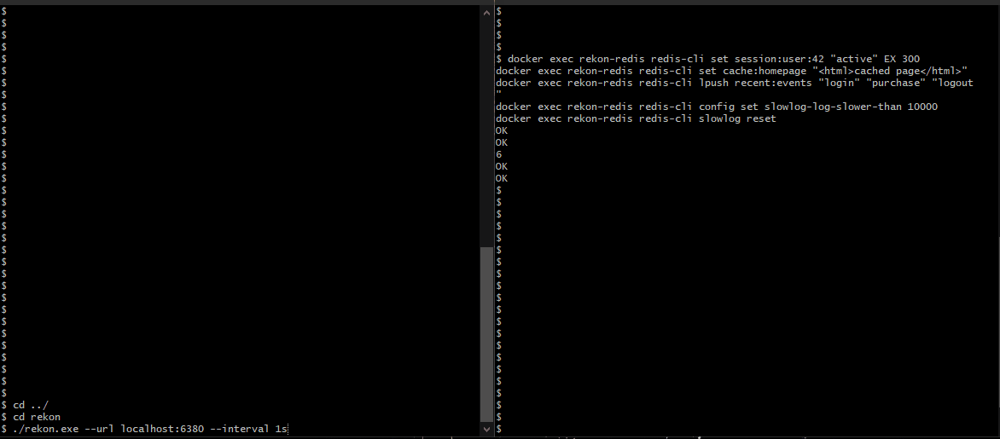

# Rekon

**A live, terminal-native TUI for Redis internals.**

btop, but it understands Redis.


<!-- TODO: record real terminal GIF once Sprint 6 lands — do not fake this -->

---

## What this is

`redis-cli --stat` gives you a scrolling table. RedisInsight gives you a
heavy GUI app you probably don't want SSH'd into a server. Neither gives you
a live, glanceable dashboard that lives where you already are: the terminal.

Rekon polls a Redis instance on an interval and renders memory pressure,
throughput, client connections, the slowlog, replication state, and
persistence status — live, in one screen, in your terminal.

## What this is not

- **Not AI-powered.** No LLM, no "root cause analysis," no inference. Every
  number on screen comes directly from a real Redis command
  (`INFO`, `SLOWLOG GET`, `CLIENT LIST`). Deterministic and auditable.
- **Not a write/admin tool.** Rekon never issues a mutating or
  configuration-changing command. It only reads. It cannot break your Redis
  instance's data or config, by design.
- **Not cluster-aware (yet).** v1 targets a single standalone or
  primary/replica instance. Cluster support is a future consideration, not
  a v1 promise.

## Install

```bash
# Coming once packaged — placeholder until Sprint 6
go install github.com/<your-username>/rekon@latest
```

Requires: network access to a Redis instance you're allowed to run
`INFO` / `SLOWLOG GET` / `CLIENT LIST` against.

## Quickstart

```bash
rekon --url redis://localhost:6379
```

Connects, starts polling every 1s (configurable), and opens the dashboard.
Press `q` to quit.

### Flags

| Flag | Default | Description |
|---|---|---|
| `--url` | `redis://localhost:6379` | Redis connection string |
| `--interval` | `1s` | Poll interval |

## What you'll see

- **Memory** — used memory, fragmentation ratio, maxmemory + eviction
  policy, eviction rate
- **Ops** — instantaneous ops/sec, keyspace hit/miss ratio
- **Clients** — connected count, blocked count, long-idle connections
- **Slowlog** — live tail, new entries highlighted since last poll
- **Replication** — role, replica count, lag (degrades gracefully on a
  standalone instance — no broken/empty section, it just doesn't appear)
- **Persistence** — last save time, RDB/AOF status, save-in-progress flag

## Roadmap

A rolling-window recording/replay feature (think: a flight recorder for a
Redis incident — replay the minutes leading up to a problem, attach the
recording to a bug report) is planned for v2, once v1 is stable and
actually used. See `ROADMAP.md` for the full sequencing and what's
explicitly out of scope for now.

## Why "Rekon"

Redis + recon (reconnaissance — watching, observing). Built as the first
implementation of a small pattern, not a Redis-only tool forever — the
underlying design isn't wedded to Redis specifically, even though that's
the only thing it speaks today.

## Contributing

Contributions welcome. Please open an issue before a large PR — this
project deliberately ships narrow and real rather than broad and
unfinished; scope changes should be discussed first.

## License

Apache 2.0 — see `LICENSE`.
